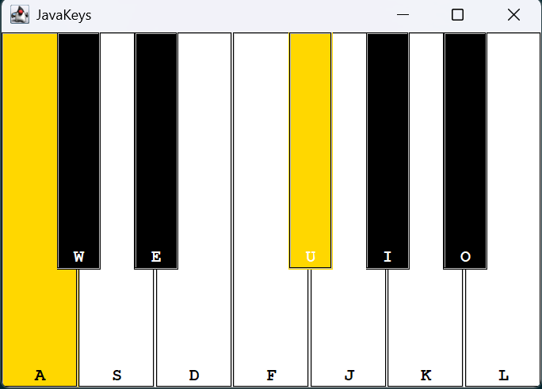
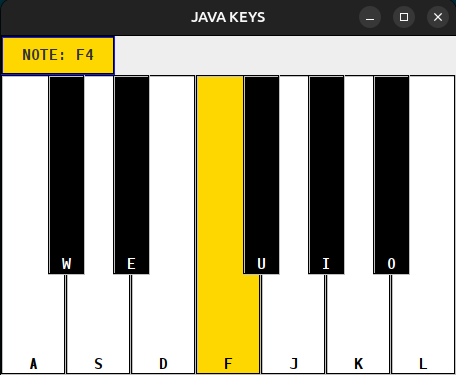

# JavaKeys

## Description
JavaKeys is a piano application built using Java Swing, supports mouse and keyboard input, and has real-time WAV audio playback.

## Author
Redeate Seife

## Features
- Interactive piano interface
- Mouse and keyboard input
- Real-time WAV audio playback
- Visual piano key highlighting
- Polyphonic note playback (multiple notes simultaneously)

## Requirements
- Java 8+
- Windows, macOS, or Linux
- No external libraries are required

## Project Structure
```
audio/
    WAV audio files used for playback

src/
    JavaKeys.java           Program entry point
    Piano.java              Handles piano GUI
    InputController.java    Handles user input
    PianoKey.java           Represents individual piano keys
    AudioEngine.java        Loads and plays audio clips
    Note.java               Enum representing piano notes
    JKT.java                Stores theme related variables

README.md
    Project documentation
```

## Instructions
### Compile
```bash
javac src/*.java
```

### Run
```bash
java -cp src JavaKeys
```

## Controls
### Mouse
```
Click a piano key to play its corresponding note.
```
### Keyboard
```
| Press Key | Play Note |
|-----------|-----------|
| A         | C4        |
| W         | C#4       |
| S         | D4        |
| E         | D#4       |
| D         | E4        |
| F         | F4        |
| U         | F#4       |
| J         | G4        |
| I         | G#4       |
| K         | A4        |
| O         | A#4       |
| L         | B4        |
```

## Implementation Details
The application is built using Java Swing for the graphical user interface.

Audio playback is implemented using the `javax.sound.sampled` package.
Each WAV file is loaded into a `Clip` object during program startup
to reduce playback delay when notes are played.

The main JavaKeys window uses a `JFrame` and the Piano is created using a `JLayeredPane`
into which piano keys are rendered using `JButton` objects.

Each piano key has mouse listeners and keybindings (via input and action maps) to handle
both mouse and keyboard input events.

## Additional Information
- Tested on Windows 11 and Linux

## Future Improvements
- Volume control
- Octave shifting
- Sustain pedal support
- MIDI keyboard input
- Recording and playback
- Multiple instrument sound packs

## Demo
| Windows | Linux | 
| :---: | :---: |
|  |  |


